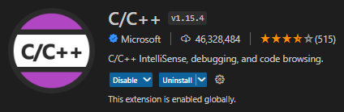
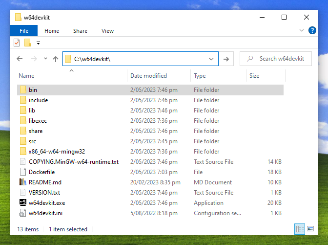
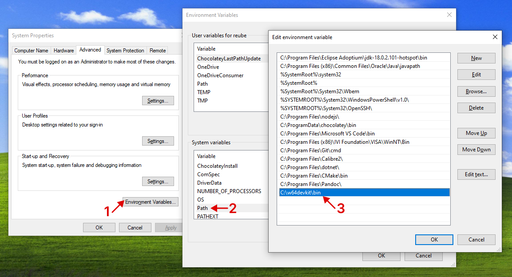

# C\C++ Compiler and Debugger

- You may use `CMakeLists.txt` to compile
- You may also `Visual Studeo Code` as a compiler/debugger
    - and follow the below instructions

***

## Lab Machines Instructions

1. Install this C\C++ extension
2. Run and Debug with F5

***

## Windows Instructions

Install the above extension and *gcc/gdb* via below:
1. Download [w64devkit-1.19.0.zip](https://github.com/skeeto/w64devkit/releases)
2. Unzip and move to `C:\w64devkit\`
    - screenshot below
3. Add `C:\w64devkit\bin` to your `PATH`
    - screenshot below

***

## MacOS Instructions

Install the above extension and *clang/lldb  via below*
1. Open terminal
2. `xcode-select --install`
    - ⚠️ Untested ⚠️ 
